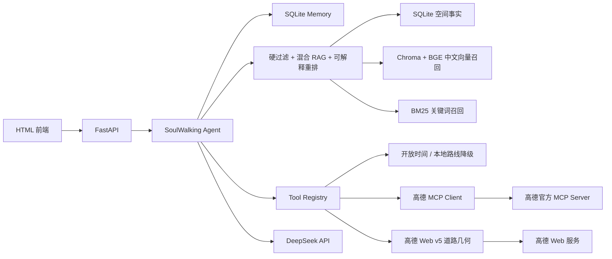

# SoulWalking：城格漫游 Agent

SoulWalking 是一个面向南京老门东的单 Agent 项目。它把五维空间人格、当下自然语言需求、空间知识库、实时工具和跨会话偏好组合起来，输出有证据、可解释、满足硬约束的城市漫步路线。

当前版本已经实现：

- 15 道 OCEAN 五维 SpaceTI 测试；
- FastAPI + Pydantic API；
- SQLite 结构化事实、Chroma 中文向量召回与 BM25 关键词召回；
- 加权 RRF 混合检索，以及人格、情境与热度的可解释重排；
- `search_spaces`、开放状态、天气、景区客流快照、餐饮 POI 与步行路线工具；
- DeepSeek OpenAI 兼容接口与无 Key 的确定性降级；
- 高德官方 Streamable HTTP MCP Client 与工具允许列表；
- MCP 路线证据 + 高德 Web v5 道路折线的后端几何补充；
- GCJ-02 坐标来源/核验状态、路线短时缓存与阶段级耗时轨迹；
- Agent 证据与执行轨迹的全中文展示，机器标识只保留在 API 数据层；
- 12 小时 TTL 的短期情境记忆、长期人格/偏好记忆、反馈及彻底清除；
- 同源 HTML 前端、Docker 与 Railway 配置；
- 30 条 RAG 评测和自动测试。

实测资料版额外实现：

- 37 个老门东实测节点、37 张现场照片与 317 点调研轨迹；
- WGS-84 源坐标保留、GCJ-02 地图坐标转换和高德路线边界隔离；
- 13 项空间特征经 W1/M1/W2/M2 临时权重映射为 8 维空间感知和 3 维 Citywalk 行为倾向；
- 节点采集表的异常坐标审计；未核验的价格、室内外、开放时间和无障碍信息不会被当作已满足条件。

> 种子空间由早期产品原型整理而来，均标记为“待实地复核”。项目不会把原型数据包装成实时、权威 POI 数据。

## 架构



工作流是：

```text
解析需求
→ 合并五维画像与 Memory
→ 硬约束预过滤
→ RAG 召回与重排
→ 开放状态 / 天气 / 景区客流快照 / 餐饮 / 路线工具
→ 时长约束校验
→ 有证据的自然语言说明
```

LLM 负责理解和解释，Python 负责计分、过滤、参数校验、超时与降级。即使没有任何 API Key，完整闭环仍可运行，但天气不可用且路线只提供直线距离估算；前端不会把该估算画成可步行道路。

## 本地启动

建议使用 Python 3.11～3.13。

```powershell
python -m venv .venv
.\.venv\Scripts\Activate.ps1
python -m pip install -e ".[dev]"
Copy-Item .env.example .env
python -m uvicorn app.main:app --reload
```

打开 <http://127.0.0.1:8000>，API 文档位于 <http://127.0.0.1:8000/docs>。

## 发给他人体验（Windows EXE）

在本机已完成资料导入、模型下载后，执行：

```powershell
.\scripts\build_windows.ps1
```

它会生成 `dist/SoulWalking/`。把**整个文件夹**压缩发送，对方解压后双击 `SoulWalking.exe` 即可自动打开本地网页，无需安装 Python。发布包包含应用依赖、实测照片、37 个节点数据和 BGE 模型缓存；首次启动通常需等待数秒。

发布包不含 `.env`，避免泄露 API 密钥。未配置密钥时仍可体验完整测试、检索和本地降级路线；需要 AI、高德天气和道路路线时，让接收者把 `.env.example` 复制为 `.env` 并填写自己的密钥。

生产环境如需中文语义模型：

```powershell
python -m pip install -e ".[embedding]"
```

然后在 `.env` 设置：

```dotenv
EMBEDDING_BACKEND=sentence-transformers
EMBEDDING_MODEL=BAAI/bge-small-zh-v1.5
```

默认使用 `BAAI/bge-small-zh-v1.5`（512 维）作为本地中文语义模型。
`hash` Embedding 只用于无网络降级和可复现测试，不应被描述为生产级语义模型。
模型默认缓存在被 Git 忽略的 `data/hf-cache`。

实测资料导入（首次或更换源文件后执行）：

```powershell
python -m pip install -e ".[dev,fieldwork]"
python scripts\import_fieldwork.py
```

该脚本从三个 Excel、GPX 和照片压缩包生成 `app/data/` 的运行时数据、
`web/assets/spaces/` 的现场图片和节点采集审计报告。权重仅是 MVP 理论映射，
不能被解释为问卷实证或回归结论。

如需重新核验老门东范围内的高德周边 POI（只生成审计数据，**不会**覆盖 37 个实测节点）：

```powershell
python scripts\fetch_amap_poi_audit.py --radius 2200
```

结果写入被 Git 忽略的 `data/amap_old_mendong_poi_audit.json`，包含 POI 去重结果和每个实测节点最近的 3 个高德 POI。该文件用于坐标/名称核验与地图展示，不参与空间评分。

## 外部服务

DeepSeek：

```dotenv
DEEPSEEK_API_KEY=...
DEEPSEEK_BASE_URL=https://api.deepseek.com
DEEPSEEK_MODEL=deepseek-v4-flash
```

高德 MCP：

```dotenv
AMAP_API_KEY=...
MCP_ENABLED=true
CONSTRAINT_PARSING_MODE=heuristic
TOOL_SELECTION_MODE=policy
WEATHER_CACHE_TTL_SECONDS=300
ROUTE_CACHE_TTL_SECONDS=600
```

`AMAP_API_KEY` 必须使用高德控制台中“绑定服务 = Web 服务”的 Key。应用会自动形成 `https://mcp.amap.com/mcp?key=...`，也可以显式提供 `AMAP_MCP_URL`。
MCP 提供路线距离、耗时和步行指令；因为当前 MCP 工具定义不提供道路折线，后端会并行调用高德 Web v5 步行接口补充 `polyline`。`CONSTRAINT_PARSING_MODE=heuristic` 与 `TOOL_SELECTION_MODE=policy` 是低延迟默认值；分别改为 `llm` 可演示 DeepSeek 约束解析和真实 Tool Calling。

### 城市情境与餐饮数据

- `GET /api/v1/city-context` 为首页提供老门东天气与南京景区客流。天气优先使用高德；无 Key 或接口失败时会明确显示本地/Demo 降级。
- 客流读取南京文旅“景区舒适度”公开页面的**定时快照**，页面没有有效发布值时显示“本时点暂未发布”，不伪造实时人数。
- 每次路线会运行 `get_tourism_crowd` 与 `search_dining` 工具，并在结果页给出餐饮卡片与高德地图标记。餐饮使用高德周边 POI（`050000` 餐饮服务）；未配置或调用失败时会返回带 `Demo 餐饮数据` 标识的固定候选。
- 项目不爬取美团、大众点评或饿了么。它们的公开可用性、授权与反爬条件不适合作为比赛演示的稳定数据源。

客流快照和餐饮 POI 都是辅助情境信息，不会替代 37 个实测节点的空间评分，也不会自动把餐厅强行插入路线；用户可据卡片自行决定是否前往。

浏览器高德地图使用另一组“Web 端（JS API）”Key：

```dotenv
AMAP_JS_KEY=...
AMAP_SECURITY_JS_CODE=...
```

安全密钥只保存在服务端，前端通过 `/_AMapService` 同源代理访问高德服务。所有密钥均不得提交到仓库，日志也不会输出完整 MCP URL 或安全密钥。

## API

### 五维计分

```http
POST /api/v1/profile/score
Content-Type: application/json

{
  "user_id": "anonymous-user-id",
  "answers": [
    {"question_id": "E1", "choice": "A"}
  ]
}
```

必须提交全部 15 道题。响应中的五维分数范围为 0～100。

### 规划

```http
POST /api/v1/plans
Content-Type: application/json

{
  "user_id": "anonymous-user-id",
  "session_id": "session-id",
  "query": "今天下雨，想找免费安静的室内历史空间，一个小时",
  "profile": {
    "openness": 80,
    "conscientiousness": 60,
    "extraversion": 20,
    "agreeableness": 70,
    "neuroticism": 80,
    "source": "test",
    "confidence": 0.9
  },
  "mode": "normal",
  "use_memory": true
}
```

响应包含：

- 结构化约束；
- 推荐空间与五项分数；
- `space:*` 和 `source:*` 证据；
- 开放状态、天气、景区客流快照、沿途餐饮和路线；
- `tool_trace`；
- `total_duration_ms`、路线缓存命中数和道路几何完整状态；
- 明确的降级警告。

### Memory

```http
GET /api/v1/profile/current
X-User-ID: anonymous-user-id

GET /api/v1/memory
X-User-ID: anonymous-user-id

GET /api/v1/memory/session?session_id=session-id
X-User-ID: anonymous-user-id

DELETE /api/v1/memory
X-User-ID: anonymous-user-id
```

长期层保存测试得到的 OCEAN 画像，以及通过 `POST /api/v1/feedback` 明确提交的
喜欢/不喜欢标签。短期层只保存当前会话中明确表达的心情、精力、独处/结伴和
安静倾向，默认 12 小时过期；短期状态不会修改长期 OCEAN。当前版本不存储
API Key、完整答题明细或不必要的原始对话。

## 测试与评测

```powershell
python -m pytest
python evals\run_retrieval.py
python evals\run_retrieval.py --embedding-backend sentence-transformers
python evals\run_memory.py
```

当前固定种子数据评测结果：

- 30 个人工构造查询；
- BGE 向量单路：Recall@3=1.00、Recall@5=1.00、MRR=0.9833；
- BM25 单路：Recall@3=1.00、Recall@5=1.00、MRR=1.00；
- 混合检索：Recall@3=1.00、Recall@5=1.00、MRR=1.00。

当前自动化与真实联调状态（2026-07-30）：

- 32 个单元/集成测试通过；
- DeepSeek `deepseek-v4-flash` 真实调用通过；
- 高德 Web 服务天气接口通过；
- 高德 MCP 工具发现通过：地理编码、天气、步行路线、地图生成；
- 三段步行路线由高德 MCP 分段规划并汇总，同时由高德 Web v5 返回 74 个道路坐标点；
- 同一三段路线实测首次约 2147ms、缓存命中约 57ms；这是单次本地联调样本，不代表生产 p50/p95；
- Edge 端到端测试通过：3 个推荐、8 条执行轨迹、3 段道路折线、高德底图正常、长期画像刷新复用成功、页面错误与控制台错误均为 0；
- 可重复执行的浏览器验收脚本位于 `scripts/browser_smoke.js`。

这组指标只证明固定小数据集上的实现正确性。正式简历应同时说明数据规模、人工构造方式，并在补充真实标注查询后重新报告。

## Render 云端部署（保留全部能力）

已提供 [`render.yaml`](render.yaml) 与 [Render 部署说明](docs/render_deployment.md)。
部署时应使用 Render Secret 保存 DeepSeek 和高德密钥；仓库和 Docker 镜像都不包含
`.env`。完整 BGE 检索与跨重启 Memory 需要 Render 付费实例和 Persistent Disk，
免费实例只建议用于 hash embedding 降级展示。

## Docker

```powershell
Copy-Item .env.example .env
docker compose up --build
```

SQLite 和 Chroma 都写入 `soulwalking-data` 持久卷。Railway 可直接读取 `railway.json` 和 `Dockerfile` 部署。

若本地网络无法访问 Docker Hub，可临时使用微软官方 Dev Container 基础镜像；默认镜像仍保持 `python:3.12-slim`：

```powershell
$env:PYTHON_BASE_IMAGE="mcr.microsoft.com/devcontainers/python:1-3.12-bookworm"
docker compose up --build
```

## 项目边界

- 只覆盖南京老门东，且部分空间名称/属性待复核；
- 单 Agent，不包含 Multi-Agent；
- 只作为空间偏好推荐，不能代替心理测量；
- 无高德服务时只保留直线距离估算，不在地图上绘制成步行路线；
- 第一版同步返回，不含 SSE；
- Memory 使用匿名本地标识，不等同于正式账号与认证系统。

详细设计、数据字典、评测说明和面试材料位于 `docs/`。
